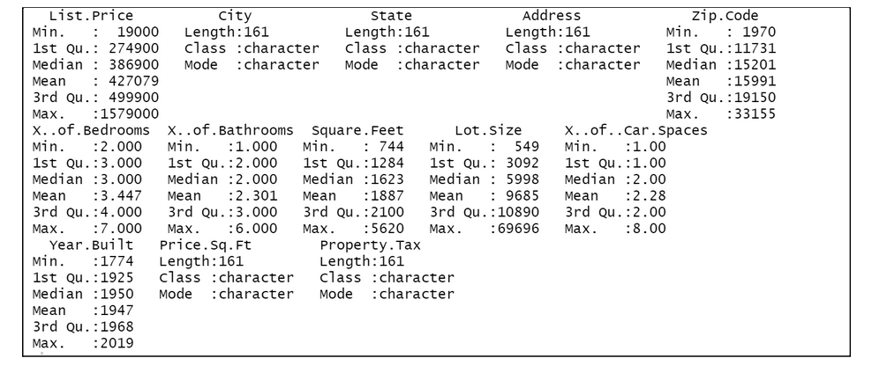
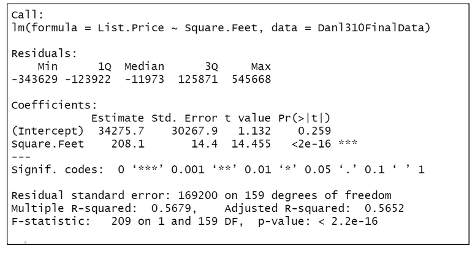
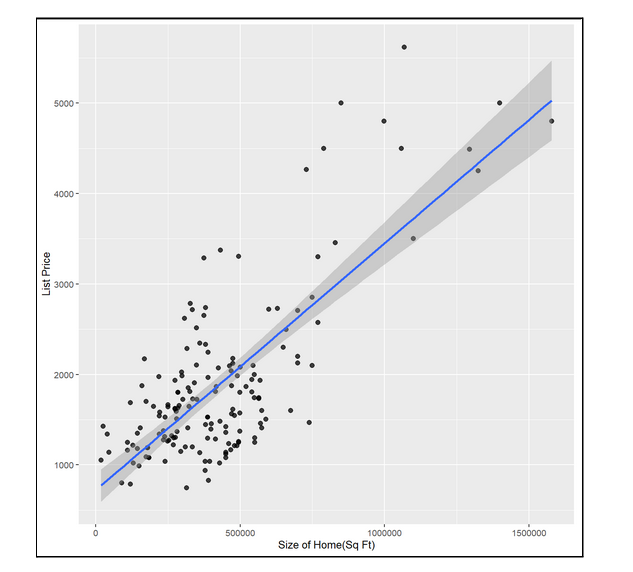
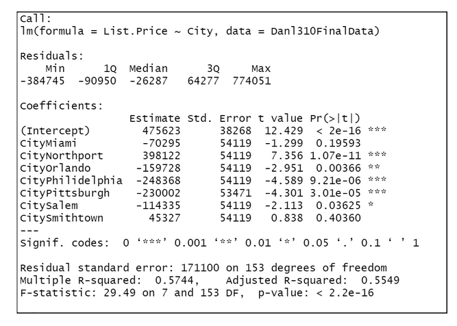
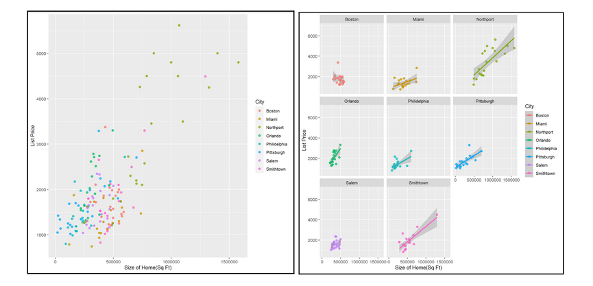
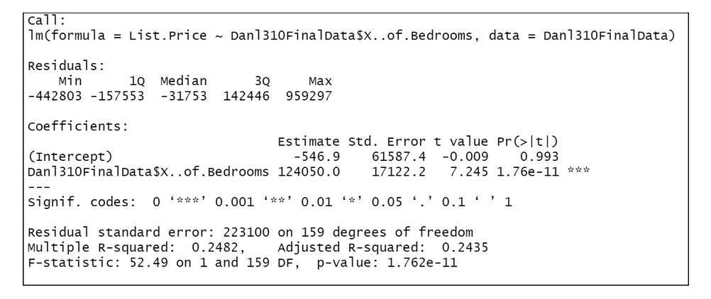
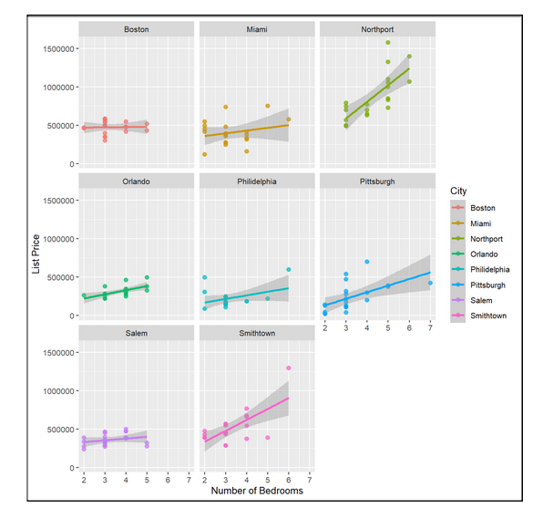
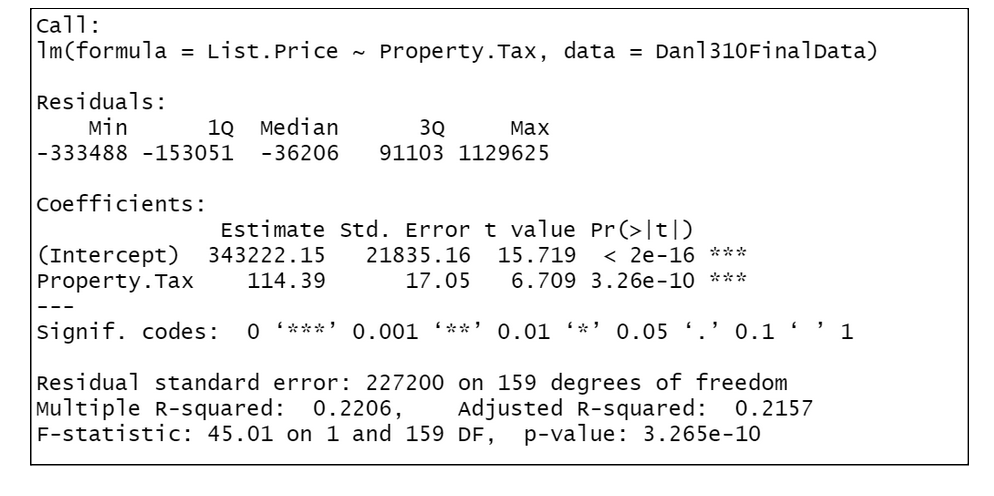
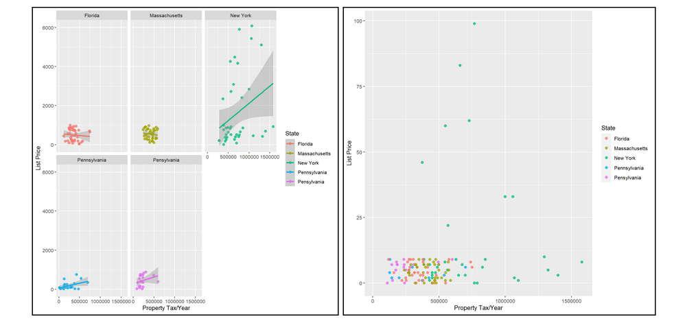

```{r setup, include=FALSE}
knitr::opts_chunk$set(echo = FALSE, message = FALSE, warning = FALSE)
library(tidyverse)
library(knitr)
library(here)
library(lubridate)
library(kableExtra)
library(DT)
library(glue)
library(readxl)
library(stringi)

# install.packages("remotes")
# remotes::install_github("mitchelloharawild/icons")
# install.packages("fontawesome")
library(fontawesome)
```

#PDF of Final Paper
Here is my [Final Project Report `r fa("fas fa-file-pdf", fill = "red")`](Data_Analytics_Final_Paper.pdf).

# Introduction
For our team project, we decided to compile data from the real estate market and look into the different variables affecting housing prices. Using the knowledge learned from our data analytics courses we will be constructing various models in order to better understand trends in real estate and how the markets in different areas around the country differ. Utilizing R Studio, we will be able to visualize this data using the ggplot2 package by building graphs of these models. The main thing we are trying to test and visualize is how the location of a home affects its price taking into account the home's features. We expect to see states with higher tax rates, such as New York, to have more expensive homes than those with lower tax rates. 
In order to get reliable data to study the test variables, we compiled a dataset that has 160+ individual homes varying in location throughout the United States. We were able to extract the data from Zillow.com, which is a reliable and up to date source to make sure our data is accurate. We extracted all of the data in our set entirely from Zillow.com, regardless of the variable. 
The results we find will allow us to compare the differences in pricing between states, which is very valuable when it comes to selecting possible residency in the future. Our models will properly visualize the distinct differences amongst regions and how the homes are valued. Given our null hypothesis which was stated prior, we expect to find New York as the most expensive state to live in, given consistent features in the homes. We also expect to see property tax and square footage to have the most impact on list price compared to the rest of the other variables. Our reasoning behind this is simple: larger homes tend to be more expensive, and property tax is a good indicator on whether or not areas are considered “wealthy.”  We are excited to present our results and deliver our findings in an accessible way to help project the differences between the state's housing values. 


<br>

# Project Motivation
Part of the reason why we decided to do this project on real estate data is because we both aspire to eventually own a home one day. We felt that this project would give us a better idea on what variables are most important when searching for a home, and which regions of the country provide the best deals in regard to list price for homes. The real estate market accounts for an estimated $43.3 trillion in the US economy. Since the great recession, houses have more than doubled in value, and we feel that it is important for everybody to understand the different trends in the real estate market if they ever wish to own a home. We hope that our research and findings will help benefit people, and shed some light on different trends that may have gone under the radar for many people.


<br>

#Description of Data


The data we compiled for this project was done so using the website Zillow.com. Zillow is a real time data source that has homes for sale all across the globe. Part of the reason why we used Zillow to compile our data was because it was up to date, accurate, and allowed us to filter by region with ease. We have 20+ data entries from 8 different cities along the east coast, including the states New York, Florida, Massachusetts. And Pennsylvania. Throughout these data entries we compiled information on 16 different variables. The variables are the following: List Price, CIty, State, Address, Zip Code, Total Bedrooms, Total Bathrooms, Square Footage of Home, Lot Size, Total Parking Spots, Year Build, Price/Square Foot,  and Property Tax. After collecting our data, we needed to make sure it was cleaned in order for the models to run without any errors in R Studio. In order to do this we utilized packages such as tidyverse and dplyr to get rid of blank entries and get rid of any outliers that may have a negative impact on our models. You can see a basic summary statistic of the compiled data in figure 1 below.


<br>

Figure 1:
{width=50%}

<br>

We can see that the majority of the houses collected in our dataset have an average of 3.4 bedrooms, 2.3 bathrooms, 2.28 car spaces, year built of 1947, and 1887 square feet. The average list price for the dataset is 427,097 dollars, with a median price of 386,900. With this data we can assume that most of the houses in the dataset have a similar number of features and that our models should be somewhat accurate going forward.

<br>

#Building Our Models

For this project we decided to use linear regression models in order to analyze and visualize our data. The reason we used linear regression models is because we want to see the relationship between the different features of a home and its list price. All together we created four linear regression models, and built many graphs that help us visualize trends using the ggplot2 package in R Studio.


<br>

#Model 1

The first model we build using this data predicts the relationship between the list price of a home given by the total number of square feet it is. Below in figure 2 we can see the summary statistics of this model.

<br>

Figure 2:
{width=50%}
<br>

As we can see by the coefficients, for every square foot added on to a home, the list price will see an increase in price by $208.1. We expected to see a positive correlation between these two variables from the beginning considering the fact that larger homes are a more highly sought after commodity in comparison to smaller homes. We can also see from these statistics that the model is statistically significant, however, the R-Squared value is only 0.05652. This means that the data isn't exactly a perfect fit and that there are other unexplained factors when determining list price, which is what we expected considering the sheer number of factors that go into pricing a home.
    In addition to building this model, we also created a basic scatter plot with a fitted linear regression line in R Studio to help better visualize our findings. This graph can be found in figure 3 below.

<br>

Figure 3:
{width=50%}
<br>

We can see that as the list price of houses increases the accuracy of our model decreases. This is most likely due to the fact that different regions of the country have different price ranges for homes, therefore making the model inaccurately predict the price due to this variable being omitted from the model.

<br>

# Model 2

The second linear regression model we built using R Studio predicts the relationship of a home given the location. Since there were a total of 8 cities we collected data from, the discrepancy of prices varied dramatically depending on which region of the country the home was located in. We can see the summary statistics of this model below in figure 4.

	
<br>

Figure 4:
{width=50%}
<br>

The one thing that stands out most about these summary statistics is that the only two cities with a positive correlation to list price are Smithtown and Northport, both of which are located in New York State. Prior to collecting the data, we made a prediction that New York would have the most expensive homes, which ended up being true as shown by these statistics. The least expensive place to live according to this model is Philadelphia, with an estimate of -248,368. This means that having a home located in Philadelphia causes a deduction of $248,368 in the list price of the exact same home that would be located in another city. We also created two scatter plots with best fit lines in order to help visualize this data better. We can find this in figure 5 below.

<br>

Figure 5:
{width=50%}

<br>

It is interesting to see that the majority of the points towards the expensive end are all located in New York State, with Orlando and Philadelphia being the two cities with the least expensive homes. 

<br>

# Model 3

We expected model 3 to draw a clear cut relationship between the number of bedrooms and listing price. We figured that the number of bedrooms is one of the main attributes that home prices are driven from. We were able to find a variety of homes on Zillow.com and that gave us the ability to find many different homes with different numbers of bedrooms. I expected this model to have one of the highest correlations with home prices. The summary statistics for model 3 are as follows. 

	
<br>

Figure 6:
{width=50%}
<br>

As we can see from our summary statistics, there is definitely a strong correlation. Not only is there a clear cut correlation between the two, the home's price significantly changes based on the number of bedrooms. It is interesting to see that every extra bedroom the home has the price will increase by $124,050. That is an extremely significant jump for each bedroom added on. This is a clear example of how important the number of bedrooms is one of if not the largest contributor to the home's price. Although our results were significant and definitely portrayed a very strong correlation, the values varied by location.  

<br>

Figure 7:
{width=50%}

<br>

Clearly there is a wide variety of slopes depending on the location. This has a lot to do with the pricing of homes per region. Obviously if you are looking for a home in an expensive area like Long Island, you will have to pay a lot more for every extra feature as opposed to places like Salem. In the figures it is clear that Northport and Smithtown have the steepest slopes, mostly because both are affluent areas of Long Island, and to live in these highly sought out locations you have to pay a pretty penny for each extra feature. I thought our findings were accurate and it was interesting to see the wide variety of valuation differences between each region we studied. 

<br>

#Model 4

Prior to our research, we hypothesized that property taxes were going to have the highest correlation with listing price. The thought process behind this was because the property taxes are driven from each feature present in a home and we thought that it was a culmination of all the features we studied. Obviously, when it comes to tax rates, the more features you pile onto a home the more you're going to have to pay in property taxes. We also hypothesized that if you can afford high property taxes, you most likely will be willing to pay more for each feature added on and that's why we believed that this would have the highest correlation. Our results are as follows. 

  
<br>

Figure 8:
{width=50%}

<br>


The results show that there is a correlation between the property taxes and the listing price. One of the difficulties with this model is that it was tough to quantify the variables to compare. As we can see there is a strong correlation and we believe that the property taxes are basically an overall reflection of every feature we studied. Another reason this model was interesting was because of how different the taxi rates were depending on the region. States like New York have the highest rates and would have the largest fluctuation in tax rates based on every added feature. 


<br>

Figure 9:
{width=50%}

<br>

Clearly in this figure there are different relationships depending on each region. New York has a large ranked slope that is very correlated and it is clear in the model. New York also has the highest level of taxes, so it wasn't surprising to see this in our figure. In this figure, it is clear that New York has the tax rates that exceed the comparing states. This is interesting because the rest of the states seemed to be clumped on the left, therefore the states are taxing their residents similarly. It was interesting to study the models and recognize the distinct differences between each region. 

<br>
# Conclusion
We were happy with the results we found from our four models and it was made easy because of our relevant research topic. We were easily able to compile the data and we were able to study many different features because of Zillow.com. This research topic taught us a lot about developing models using R Studio and being able to understand/portray our results. We believe that we chose the topic that could best help the class in the future and our results were easy to understand and showed clear distinctions based on region. Professor, we appreciate all of your help throughout the past two semesters and can look back on our past two classes with nothing but good memories. 

<br>


# Works Cited

Work Cited
Zillow: Real Estate, Apartments, Mortgages & Home Values, https://www.zillow.com/. Accessed 18 May 2022.


