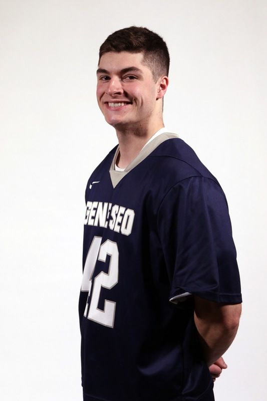

```{r setup, include=FALSE}
knitr::opts_chunk$set(echo = FALSE, message = FALSE, warning = FALSE)
library(tidyverse)
library(knitr)
library(here)
library(lubridate)
library(kableExtra)
library(DT)
library(glue)
library(readxl)
library(stringi)

# install.packages("remotes")
# remotes::install_github("mitchelloharawild/icons")
# install.packages("fontawesome")
library(fontawesome)


#### publications #####
publications <- read_csv("_content/publications.csv")

#### all other entries #####
cv_entries <- read_csv("_content/cv_entries.csv") %>%
  mutate(year_begin = year(date)) %>%
  mutate(year_end = case_when(
    date_end == "present" ~ date_end,
    !is.na(date_end) ~ str_sub(date_end, 1, 4),
    is.na(date_end) ~ date_end
  )) %>%
  mutate(year = ifelse((is.na(year_end) | year_begin == year_end),
                      year_begin,
                      str_c(year_begin, " --- ", year_end)))


blank_year_when_repeated <- function(cv_entry_tibble){
  cv_entry_tibble %>% 
    mutate(row_number = row_number()) %>% 
    mutate(year_begin = as.character(year_begin),
           year_begin = case_when(
             row_number == 1 ~ year_begin,
             year_begin == lag(year_begin) ~ str_c('<span class="repeated-year">', year_begin, '</span>'),
             year_begin != lag(year_begin) ~ year_begin
           )) %>% 
    mutate(year = if_else(!is.na(lag(year)) & lag(year) == year, 
                          str_c('<span class="repeated-year">', year, '</span>'),
                          year))
}
```


# Summary

:::: {style="display: flex;"}

::: {}
I am currently a senior student athlete studying for my **Bachelors Degree in Economics** at **SUNY Geneseo**. Following graduation this upcoming spring, I will be attending **Binghamton University** to study for my **Masters of Business Administration in Finance**. My future aspirations include working in the **financial services indistry** after attaining my MBA next year.


Here is my [Resume `r fa("fas fa-file-pdf", fill = "red")`](Nicholas_Palmer_Resume.pdf).

<div style="text-align: right"> Last updated: `r Sys.Date()` </div>
:::


::: {}
{width = 75%}
:::

::::


<br>

# Current Position
```{r}
cv_entries %>% 
  filter(type == 'current_positions', is.na(exclude)) %>%
  mutate(what = str_c("<span class='cv-entry-title'>", what, "</span><br>", 
                      where)) %>% 
  select(year, what) %>% 
  kbl(padding = 0, col.names = NULL, escape = FALSE) %>%
  kable_styling( bootstrap_options = c("hover", "condensed"))  %>% 
  column_spec(1, width = "15%")

```

<br>

# Education
```{r}
cv_entries %>% 
  filter(type == 'education') %>% 
  mutate(what = str_c( "<span class='cv-entry-title'>", 
                              what, "</span>, ", where,
                              "<br>", 
                       ifelse(is.na(additional_info), "", additional_info) 
                       , "<br>", 
                       ifelse(is.na(additional_info2), "", additional_info2))) %>% 
  select(year, what) %>% 
  kbl(padding = 0, col.names = NULL, escape = FALSE) %>%
  kable_styling( bootstrap_options = c("hover", "condensed"))   %>% 
  column_spec(1, width = "15%")

```


<br>

# Teaching
```{r}
cv_entries %>% 
  filter(type == 'teaching') %>% 
  mutate(what = ifelse(!is.na(additional_info), 
    str_c("<span class='cv-entry-title'>", what, "</span><br class='work-break'>", where, "<br>", additional_info),
    str_c("<span class='cv-entry-title'>", what, "</span><br class='work-break'>", where))) %>% 
  select(year, what) %>% 
  kbl(padding = 0, col.names = NULL, escape = FALSE) %>%
  kable_styling( bootstrap_options = c("hover", "condensed"))  %>% 
  column_spec(1, width = "15%") 
  
```

<br>

# Service
```{r}
cv_entries %>% 
  filter(type == 'service') %>% 
  mutate(where = ifelse(!is.na(url), str_c("[", where, "](", url, ")"), where)) %>% 
  mutate(what = ifelse(!is.na(additional_info),
                       str_c("<span class='cv-entry-title'>", what,
                      "</span><br class='work-break'>", 
                      where),
                      str_c("<span class='cv-entry-title'>", what,
                      "</span><br class='work-break'>", 
                      where))) %>% 
  arrange(desc(date_end), desc(date)) %>% 
  select(year, what) %>% 
  kbl(padding = 0, col.names = NULL, escape = FALSE) %>%
  kable_styling( bootstrap_options = c("hover", "condensed")) %>% 
  column_spec(1, width = "15%")  

```


<br>

# Work Experience
```{r}
cv_entries %>% 
  filter(type == 'work', is.na(website)) %>% 
  mutate(additional_info = replace_na(additional_info, "")) %>% 
  mutate(what = str_c("<span class='cv-entry-title'>", what, "</span><br class='work-break'>", where, "<br>", additional_info)) %>% 
  arrange(desc(date)) %>% 
  select(year, what) %>% 
  kbl(padding = 0, col.names = NULL, escape = FALSE) %>%
  kable_styling( bootstrap_options = c("hover", "condensed"))   %>% 
  column_spec(1, width = "15%")
```

<br>

# Professional activities
```{r}
cv_entries %>% 
  filter(type == 'prof-act') %>% 
  mutate(what = str_c("<span class='cv-entry-title'>", what, "</span>, ", where)) %>% 
  select(year_begin, what) %>% 
  kbl(padding = 0, col.names = NULL, align = c("l", "l"), escape = FALSE) %>%
  kable_styling( bootstrap_options = c("hover", "condensed")) %>% 
  column_spec(1, width = "15%")  
```

<br>

# Hornors & Awards
```{r}
cv_entries %>% 
  filter(type == 'awards') %>%
  filter(!(website == "n") | is.na(website)) %>% 
  mutate(what = if_else(
    !is.na(where),
    str_c("<span class='cv-entry-title'>", what, "</span>, ", where),
    str_c("<span class='cv-entry-title'>", what, "</span>"))
  ) %>% 
  blank_year_when_repeated() %>% 
  select(year_begin, what) %>% 
  kbl(padding = 0, col.names = NULL, align = c("l", "l"), escape = FALSE) %>%
  kable_styling( bootstrap_options = c("hover", "condensed"))   %>% 
  column_spec(1, width = "15%")
```
 
<br>

# Grants and funding
```{r}
cv_entries %>% 
  filter(type == 'minor_grants' | type == 'major_grants',
         is.na(exclude)) %>%
  filter(!(website == "n") | is.na(website)) %>% 
  mutate(what = if_else(
    !is.na(additional_info),
    str_c("<span class='cv-entry-title'>", what, "</span>, ", where, "<br>", additional_info),
    str_c("<span class='cv-entry-title'>", what, "</span>, ", where))
  ) %>% 
  blank_year_when_repeated() %>% 
  select(year, what) %>% 
  kbl(padding = 0, col.names = NULL, align = c("l", "l"), escape = FALSE)  %>%
  kable_styling( bootstrap_options = c("hover", "condensed")) %>% 
  column_spec(1, width = "15%")   
```


<br>

# Miscelaneous
## Computing skills
```{r}
cv_entries %>% 
  filter(type == 'technical') %>% 
  mutate(icon = case_when(
    str_detect(what, "data analysis") ~ "fa-bar-chart",
    str_detect(what, "research") ~ "fa-flask",
    str_detect(what, "Web") ~ "fa-laptop"
  )) %>% 
  mutate(what = str_c("<i class='fa fa-lg ", icon, "'></i> &nbsp;<span class='cv-entry-title'>", what, "</span> ", additional_info)) %>% 
  select(type, what) %>% 
  mutate(type = "") %>% 
  kbl(padding = 0, col.names = NULL, escape=FALSE) %>%
  kable_styling( bootstrap_options = c("hover", "condensed")) 
```

<br>


## Skills & volunteering
```{r}
cv_entries %>%
  filter(type == 'volunteering') %>%
  mutate(what = str_c("<span class='cv-entry-title'>", what, "</span><br class='work-break'>", where)) %>%
  mutate(what = ifelse(!is.na(additional_info), str_c(what, "<br>", additional_info), what)) %>%
  arrange(desc(date_end)) %>% 
  select(year, what) %>%
  kbl(padding = 0, col.names = NULL, escape = FALSE)  %>%
  kable_styling( bootstrap_options = c("hover", "condensed")) %>% 
  column_spec(1, width = "15%")
```

